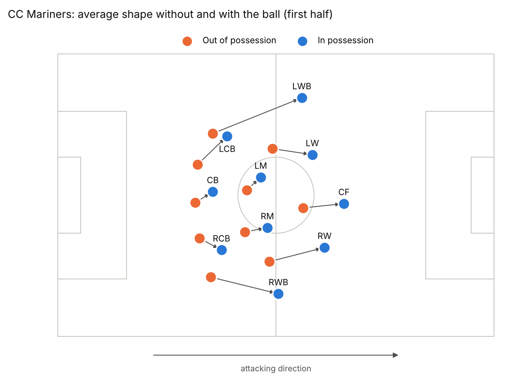

# Real Formations from Tracking Data

What formation does a team actually play with the ball and without it, and how does each player move between the two? This project answers that from SkillCorner broadcast tracking data, the way Football Manager shows a team's in possession and out of possession shapes, but measured from real matches.

Prototype built on the [SkillCorner open data](https://github.com/SkillCorner/opendata): 20 A-League matches from 2024/25.



CC Mariners defend in a 5-3-2 (orange) and become a 3-4-3 with the ball (blue), with both wing backs pushing about 15 m forward.

## How it works

There is no trained machine learning model. Everything runs directly on the tracking data with two building blocks:

**1. Shape pipeline** (`src/shape_pipeline.py`). Loads each match, removes goalkeepers, and rotates coordinates so every team always attacks toward +x (left side = +y). Computes team width, depth, compactness and defensive line height for every frame. Validated against SkillCorner's own published team width and length (r = 0.99, median error 0.01 m).

**2. Role assignment** (`src/roles.py`). Gives every outfield player a formation slot in every frame, using a simplified version of the method in Bialkowski et al. (2014), *Large-scale analysis of soccer matches using spatiotemporal tracking data*:

1. For each team, half and possession state, express players' positions relative to the team's centre.
2. Start with 10 slot templates: the average positions of the 10 players who appear most.
3. In every frame, match the 10 players to the 10 slots one to one, minimizing total squared distance. This is the **Hungarian algorithm** (`scipy.optimize.linear_sum_assignment`).
4. Move each template to the average position of everyone assigned to it.
5. Repeat steps 3 and 4 until assignments stop changing (up to 30 rounds).

Because slots are reassigned every frame, substitutions and position swaps are handled automatically. Slots are named after the player who fills them most, which links a slot across halves and possession states. Runs at 5 Hz (every second frame).

## Validation

| Check | Result |
|---|---|
| Slots in the right order front to back, vs official positions | 96% of 5,125 player pairs |
| Slots in the right order left to right | 97% of 2,419 player pairs |
| Do off camera (estimated) positions look artificially disciplined? | No: −0.3 points when compared within player and at the same distance from the ball |

**Time spent in own slot** (higher = holds position more):

| Position | In possession | Out of possession |
|---|---|---|
| Centre back | 83% | 83% |
| Full back | 78% | 81% |
| Defensive mid | 60% | 62% |
| Wide or attacking mid | 60% | 64% |
| Winger | 62% | 67% |
| Centre forward | 55% | 57% |

Players near the ball hold their slot about 56% of the time, rising to 81 to 85% when more than 40 m away. Rotations happen around the ball.

## Files

```
src/
  download_data.py      download raw tracking files (1.8 GB) from SkillCorner's repo
  shape_pipeline.py     load, clean, normalize direction, team shape features
  validate_and_plot.py  check shape features against SkillCorner's numbers
  roles.py              role assignment (the core method above)
analysis/
  validate_roles.py     official position check, rotation rates, camera check
  formation_plot.py     formation figures with and without the ball
data/
  raw/<match_id>/       match.json and phases_of_play.csv for all 20 matches
  processed/
    roles/<match_id>.parquet          one row per outfield player per frame (5 Hz), with slot
    shape_features/<match_id>.parquet one row per team per frame (10 Hz)
    roles_*.csv                       validation outputs
    shape_by_team_and_phase.csv, validation_vs_skillcorner.csv
figures/
```

**`roles` columns:** `match_id, frame, period, team_id, player_id, x, y` (meters, team attacking +x), `detected` (seen by the camera), `ball_x, ball_y`, `state` (in / out of possession), `slot`, `rx, ry` (position relative to team centre), `role_player` (the player whose slot this is).

## Run it

```bash
pip install -r requirements.txt
python src/download_data.py            # about 1.8 GB
python src/shape_pipeline.py           # about 2 min
python src/validate_and_plot.py
python src/roles.py                    # about 3 min
python analysis/validate_roles.py
python analysis/formation_plot.py 2007721 870    # one team in one match
python analysis/formation_plot.py overview       # every team match
```

## Next steps

- Formations by **ball zone**: split the pitch into zones and show the shape for each ball location.
- **Transformations**: which roles move most when possession changes, and common patterns across teams.
- **Game state**: does a team's shape change when it is losing?
- Run on NWSL and WSL data if selected through the SkillCorner call for proposals.

## License

Code is MIT licensed. Raw data is from [SkillCorner open data](https://github.com/SkillCorner/opendata), also MIT licensed; see `data/raw/LICENSE_SKILLCORNER`.
